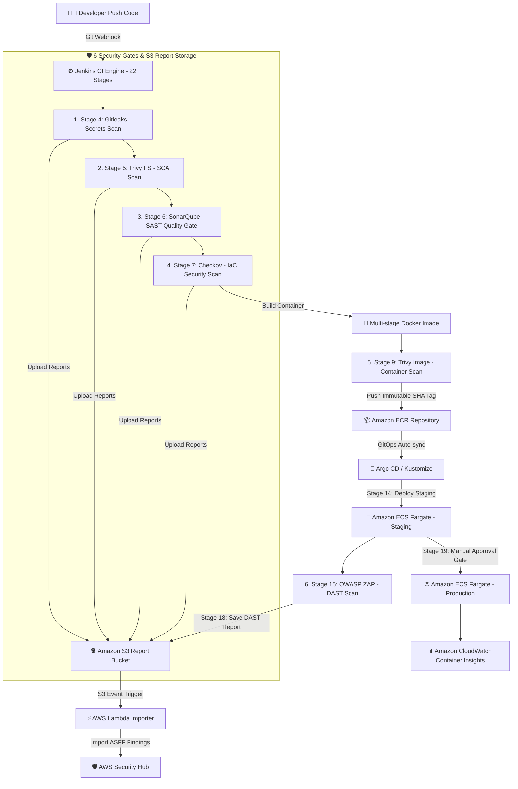

# AWS FCAJ Internship Report 🌟

<div align="center">


-purple?style=for-the-badge)

</div>

---

Chào mừng bạn đến với repo báo cáo thực tập của nhóm dự án **DevSecOps Factory trên AWS** thuộc chương trình **AWS First Cloud AI Journey (FCAJ)**! 👋

## 📋 Giới thiệu

Website báo cáo thực tập này ghi lại toàn bộ hành trình thực tập của nhóm với đề tài:

> **"Xây dựng hệ thống CI/CD DevSecOps end-to-end cho ứng dụng Web React trên Amazon ECS Fargate"**

Dự án áp dụng mô hình **Shift-Left Security** và chiến lược **Local-first, Cloud-after** — phát triển và kiểm thử offline trên cụm **k3d** local trước khi triển khai lên **Amazon ECS Fargate**. Quy trình tự động hóa tích hợp 6 cổng kiểm thử an ninh (Gitleaks, Trivy SCA, SonarQube, Checkov, Trivy Image, OWASP ZAP) trong **Jenkins Pipeline 22 Stages**, lưu trữ báo cáo tập trung trên **Amazon S3**, chuẩn hóa ASFF đẩy tự động qua **AWS Lambda Aggregator** vào **AWS Security Hub** và triển khai GitOps với **Argo CD**.

---

## 🚀 Xem báo cáo trực tiếp (Live Demo)

Website báo cáo thực tập được xuất bản tự động qua GitHub Pages:

👉 **[https://namcris07.github.io/aws-fcaj-report/](https://namcris07.github.io/aws-fcaj-report/)**

---

## 🏗️ Kiến trúc & Quy trình DevSecOps (Pipeline 22 Stages Flow)



---

## 📚 Nội dung báo cáo (7 Phần chính)

Trang báo cáo song ngữ (Anh - Việt) bao gồm 7 phần nội dung chi tiết:

| STT | Danh mục | Mô tả |
| :--- | :--- | :--- |
| 1️⃣ | **[Worklog](https://namcris07.github.io/aws-fcaj-report/1-worklog/)** | Nhật ký công việc hàng tuần của nhóm từ Tuần 1 đến Tuần 9 |
| 2️⃣ | **[Proposal](https://namcris07.github.io/aws-fcaj-report/2-proposal/)** | Ý tưởng, mục tiêu, kiến trúc giải pháp DevSecOps Factory trên ECS Fargate & Danh mục tài liệu tham khảo (References) |
| 3️⃣ | **[Blogs Posted](https://namcris07.github.io/aws-fcaj-report/3-blogsposted/)** | Tổng hợp các bài blog kỹ thuật chuyên sâu xuất bản trên AWS Study Group |
| 4️⃣ | **[Event Participated](https://namcris07.github.io/aws-fcaj-report/4-eventparticipated/)** | Nhật ký tham gia FCAJ Community Day, AWS Study Tour, Tech Meetup & Agentic AI Build Week |
| 5️⃣ | **[Workshop](https://namcris07.github.io/aws-fcaj-report/5-workshop/)** | Hướng dẫn lab thực hành chi tiết từng bước (Step-by-step Lab Guides 5.1 -> 5.6) với đầy đủ Code Snippets & Ảnh minh chứng thực tế |
| 6️⃣ | **[Self-evaluation](https://namcris07.github.io/aws-fcaj-report/6-self-evaluation/)** | Tự đánh giá năng lực theo tiêu chuẩn FCAJ, kết quả thu hoạch và bài học kinh nghiệm |
| 7️⃣ | **[Feedback](https://namcris07.github.io/aws-fcaj-report/7-feedback/)** | Cảm nhận, chia sẻ và đóng góp ý kiến về chương trình thực tập AWS FCAJ |

---

## 🛠️ Công nghệ & Công cụ sử dụng

| Lĩnh vực | Công nghệ / Công cụ |
| :--- | :--- |
| **AWS Cloud Services** | Amazon ECS Fargate *(tetris-staging & tetris-production)*, Amazon ECR, Amazon S3 *(Reports Storage)*, AWS Lambda *(Security Hub Importer)*, AWS Security Hub, Amazon CloudWatch Container Insights, AWS IAM |
| **DevOps & GitOps** | Jenkins *(22-stage Groovy Pipeline)*, Argo CD *(GitOps)*, Docker *(Multi-stage)*, Kustomize, k3d *(Local K8s)*, Application Load Balancers (ALB) |
| **Security Gates (6 Cổng)** | Gitleaks *(Secrets)*, Trivy FS *(SCA)*, SonarQube *(SAST)*, Checkov *(IaC — 34 failures detected)*, Trivy Image *(Container Scan)*, OWASP ZAP *(DAST)* |
| **Website & Hosting** | Hugo Static Site Generator (`hugo-theme-learn`), GitHub Pages, GitHub Actions |
| **Ngôn ngữ hỗ trợ** | Song ngữ Việt - Anh (Bilingual VN/EN) |

---

## 📁 Cấu trúc Repository

```text
fcj-workshop-template/
├── .github/              # Workflow CI/CD build & deploy GitHub Pages
├── archetypes/           # Hugo template archetypes
├── content/              # Nội dung bài viết Markdown (Song ngữ .md / .vi.md)
│   ├── 1-Worklog/        # Nhật ký công việc hàng tuần (Tuần 1 - 9)
│   ├── 2-Proposal/       # Đề xuất dự án, kiến trúc ECS Fargate & References
│   ├── 3-BlogsPosted/    # Bài viết kỹ thuật (Blog 1 - 3)
│   ├── 4-EventParticipated/ # Sự kiện tham gia (Event 1 - 4)
│   ├── 5-Workshop/       # Hướng dẫn workshop lab (5.1 -> 5.6)
│   ├── 6-SelfEvaluation/ # Tự đánh giá năng lực
│   └── 7-Feedback/       # Góp ý & Phản hồi
├── layouts/              # Custom Hugo layouts & shortcodes
├── static/               # Hình ảnh minh chứng, tài nguyên tĩnh & favicon
├── themes/               # Hugo theme (hugo-theme-learn submodule)
├── config.toml           # Cấu hình website Hugo & Menu
└── README.md             # Tài liệu hướng dẫn Repository
```

---

## 💻 Hướng dẫn chạy cục bộ (Local Development)

### Yêu cầu tiên quyết
- **Hugo** (Phiên bản Extended, v0.120.0 trở lên)
- **Git**

### Các bước thực hiện

1. **Clone repository bao gồm submodules:**
   ```bash
   git clone --recursive https://github.com/namcris07/aws-fcaj-report.git
   cd aws-fcaj-report
   ```
   *Nếu đã clone repo mà chưa pull submodule:*
   ```bash
   git submodule update --init --recursive
   ```

2. **Khởi chạy Hugo Dev Server:**
   ```bash
   hugo server -D
   ```

3. **Truy cập website trên trình duyệt:**
   Mở địa chỉ: `http://localhost:1313/aws-fcaj-report/`

---

## 👥 Thành viên nhóm thực tập

| Thành viên | Vai trò chính | Email liên hệ | GitHub |
| :--- | :--- | :--- | :--- |
| **Vũ Hải An** | AWS Infrastructure & Platform *(ECS Fargate, ECR, S3, IAM)* | `23520035@gm.uit.edu.vn` | - |
| **Huỳnh Nhật Linh** | CI/CD Engine & GitOps Pipeline *(Jenkins, Argo CD)* | `linh.huynhnhat@hcmut.edu.vn` | - |
| **Bùi Hữu Lợi** | DevSecOps Security Gates *(6 Security Gates, Lambda Aggregator)* | `loi.bui2311972@hcmut.edu.vn` | [@loi-bui0703](https://github.com/loi-bui0703) |
| **Nguyễn Văn Hào** | Application, Docker & ECS Manifests *(React, Dockerfile, Task Def)* | `23520448@gm.uit.edu.vn` | - |
| **Nguyễn Chu Hải Nam** | Observability, QA & Documentation *(CloudWatch, Hugo Site)* | `nam.nguyennamcris7@hcmut.edu.vn` | [@namcris07](https://github.com/namcris07) |

---

## 📄 License & Bản quyền

Copyright © 2026 AWS FCAJ Internship Report - **DevSecOps Factory Team**.

---

<div align="center">

_Được thực hiện với ❤️ và ☕ trong chương trình AWS First Cloud AI Journey (FCAJ) Internship_

**Happy Coding & Safe Deployment! 🚀**

</div>